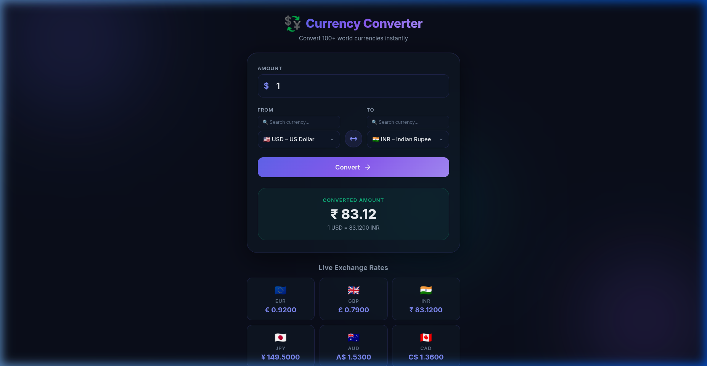
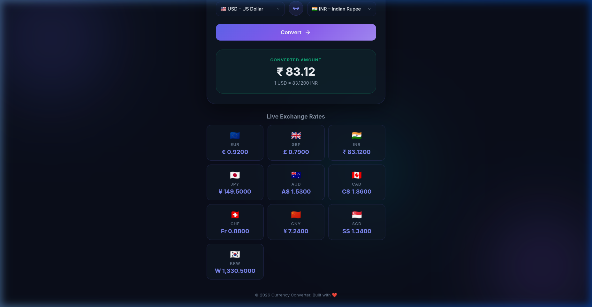
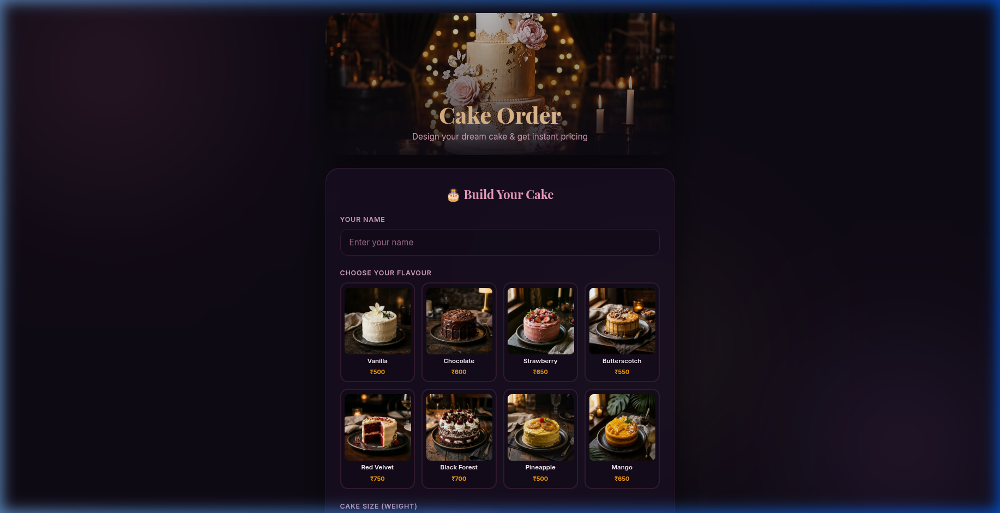
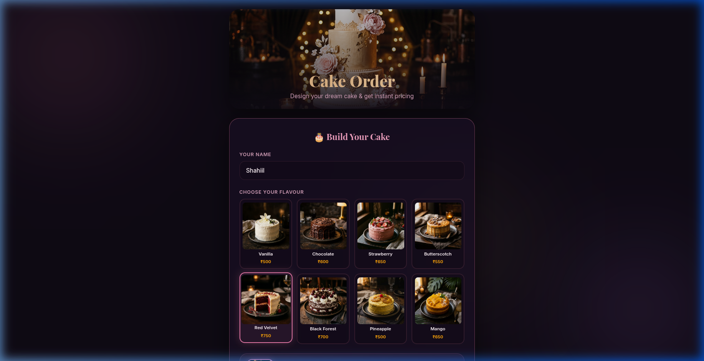
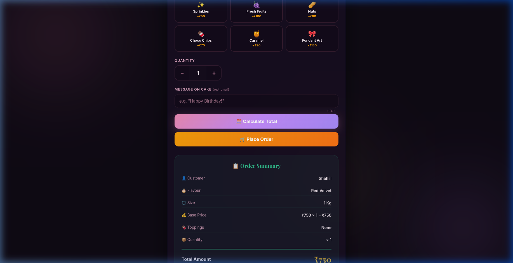

# AIWD-ex-4

## 🌐 AI Web Development — Exercise 4

> **DOM Access, Event Handling & Client-Side Calculations using HTML, CSS & JavaScript**

This repository contains **two programs** built as part of the AI Web Development course (Exercise 4). Both programs demonstrate advanced DOM manipulation, event handling, and dynamic calculations with premium, professional UI designs.

---

## 📁 Repository Structure

```
AIWD-ex-4/
├── program1/                    # Currency Converter
│   ├── index.html
│   ├── style.css
│   └── script.js
├── program2/                    # Cake Order Calculator
│   ├── index.html
│   ├── style.css
│   ├── script.js
│   └── images/                  # AI-generated cake images
│       ├── hero.png
│       ├── vanilla.png
│       ├── chocolate.png
│       ├── strawberry.png
│       ├── butterscotch.png
│       ├── redvelvet.png
│       ├── blackforest.png
│       ├── pineapple.png
│       ├── mango.png
│       └── toppings.png
├── screenshots/                 # Application screenshots
│   ├── currency-converter.png
│   ├── currency-live-rates.png
│   ├── cake-hero-flavours.png
│   ├── cake-selected-flavour.png
│   └── cake-order-summary.png
└── README.md
```

---

## 🖥️ Program 1: Currency Converter

A professional-grade currency converter supporting **70+ world currencies** with live exchange rates, search/filter functionality, and real-time conversion.

### ✨ Features

- 💱 Convert between **70+ world currencies** (USD, EUR, GBP, INR, JPY, AUD, and many more)
- 🔍 **Search & filter** currencies in dropdown for quick access
- 🔄 **Swap currencies** with a single click
- ⚡ **Real-time conversion** as you type (no need to press convert)
- 📊 **Live exchange rate cards** showing popular currency rates
- 🌈 **Dark glassmorphism UI** with animated background blobs
- 📱 **Fully responsive** design for all screen sizes

### 📸 Screenshots

#### Converter Interface


#### Live Exchange Rates


### 🛠️ Technologies Used

| Technology | Purpose |
|:---:|:---:|
| HTML5 | Semantic structure & form elements |
| CSS3 | Glassmorphism, animations, responsive design |
| JavaScript | DOM manipulation, event handling, calculations |
| Google Fonts | Inter font family |

---

## 🎂 Program 2: Cake Order Calculator

A premium cake ordering application with **AI-generated cake images**, interactive flavour selection, customizable toppings, and dynamic order calculation.

### ✨ Features

- 🖼️ **AI-generated cake images** for all 8 flavours (Vanilla, Chocolate, Strawberry, Butterscotch, Red Velvet, Black Forest, Pineapple, Mango)
- 🎨 **Visual flavour selection** — click on beautiful cake photos to choose your flavour
- ⚖️ **Size multiplier** — 0.5 Kg, 1 Kg, 1.5 Kg, 2 Kg with price scaling
- 🍫 **6 Extra toppings** — Sprinkles, Fruits, Nuts, Choco Chips, Caramel, Fondant Art
- 🔢 **Quantity controls** — +/- buttons with manual input
- ✉️ **Personalized message** — custom cake message with character counter
- 📋 **Detailed order summary** — full price breakdown dynamically generated
- 🛒 **Place order** with confirmation
- 🌙 **Dark bakery theme** with pink/gold accents

### 📸 Screenshots

#### Hero Banner & Flavour Selection


#### Flavour Selected with Preview


#### Order Summary & Calculation


### 🧮 Price Calculation Logic

```
Total = (Base Flavour Price × Size Multiplier + Toppings Total) × Quantity

Example:
  Red Velvet (₹750) × 1.5 Kg = ₹1,125 (Base)
  + Fruits (₹100) + Caramel (₹90) = ₹190 (Toppings)
  Subtotal = ₹1,315
  × 1 Quantity = ₹1,315 (Grand Total)
```

### 🍰 Available Flavours & Prices

| Flavour | Price | Image |
|:---:|:---:|:---:|
| Vanilla | ₹500 |  |
| Chocolate | ₹600 |  |
| Strawberry | ₹650 |  |
| Butterscotch | ₹550 |  |
| Red Velvet | ₹750 |  |
| Black Forest | ₹700 |  |
| Pineapple | ₹500 |  |
| Mango | ₹650 |  |

---

## ✅ Test Case Coverage

Both programs satisfy the following **10 test cases** for DOM access, event handling, and client-side calculations:

| TC ID | Module / Feature | Description | Implementation |
|:---:|:---:|:---|:---|
| TC01 | DOM Access | `getElementById` and `querySelector` | ✅ All form inputs, result containers, and display elements accessed |
| TC02 | DOM Access | `getElementsByClassName` and `querySelectorAll` | ✅ Multiple elements like currency selects, form groups, radio/checkbox cards |
| TC03 | DOM Access | `getElementsByTagName` | ✅ All labels, inputs, buttons, sections, options/images accessed |
| TC04 | Event Handling | `onclick` and `onkeyup` events | ✅ Convert/Calculate/Swap buttons (onclick), Amount/Name/Message inputs (onkeyup) |
| TC05 | Event Handling | `onchange` and `onsubmit` events | ✅ Currency/Flavour/Size/Topping selectors (onchange), Form submission (onsubmit + preventDefault) |
| TC06 | Event Handling | `onload` event | ✅ `<body onload="initApp()">` — initializes app, populates elements, logs TC data |
| TC07 | DOM Manipulation | Dynamic content update without page reload | ✅ Result display, order summary, rate cards generated dynamically via createElement/innerHTML |
| TC08 | Calculations | Client-side mathematical operations | ✅ Currency conversion with exchange rates; Cake pricing with base × size + toppings × qty |
| TC09 | CSS & UI Design | Professional, responsive styling | ✅ Glassmorphism, gradients, animations, responsive breakpoints, Google Fonts |
| TC10 | Overall Integration | Complete functional workflow | ✅ Full end-to-end user flows working for both programs |

---

## 🚀 How to Run

1. **Clone the repository:**
   ```bash
   git clone https://github.com/shahiilr/AIWD-ex-4.git
   ```

2. **Open Program 1 (Currency Converter):**
   ```bash
   # Open in browser
   open program1/index.html
   # OR on Linux
   xdg-open program1/index.html
   ```

3. **Open Program 2 (Cake Order Calculator):**
   ```bash
   open program2/index.html
   # OR on Linux
   xdg-open program2/index.html
   ```

> **Note:** No build tools, frameworks, or server needed — these are pure HTML/CSS/JS applications that run directly in any modern browser.

---

## 🎨 Design Highlights

### Program 1 — Currency Converter
- **Theme:** Dark mode with indigo/purple glassmorphism
- **Font:** Inter (Google Fonts)
- **Effects:** Animated background blobs, hover glow, smooth transitions
- **Layout:** Single-card centered layout with live rate ticker

### Program 2 — Cake Order Calculator
- **Theme:** Dark bakery with pink/gold accents
- **Fonts:** Playfair Display (headings) + Inter (body)
- **Effects:** Hero image parallax, card hover elevations, pulse animations
- **Assets:** AI-generated high-quality cake photography

---

## 📝 DOM Methods Used

```javascript
// TC01: getElementById & querySelector
document.getElementById("amount")
document.querySelector("#resultContainer")

// TC02: getElementsByClassName & querySelectorAll
document.getElementsByClassName("currency-select")
document.querySelectorAll(".form-group")

// TC03: getElementsByTagName
document.getElementsByTagName("label")
document.getElementsByTagName("input")
```

## 🎯 Event Handlers Used

```javascript
// TC04: onclick & onkeyup
onclick="convertCurrency()"       // Button clicks
onkeyup="handleAmountKeyup()"    // Live input feedback

// TC05: onchange & onsubmit
onchange="handleCurrencyChange()" // Dropdown changes
onsubmit="handleFormSubmit(event)" // Form submission

// TC06: onload
onload="initApp()"                // Page initialization
```

---

## 👨‍💻 Author

**Shahiil R**

- GitHub: [@shahiilr](https://github.com/shahiilr)

---

## 📄 License

This project is created for educational purposes as part of AI Web Development coursework.
