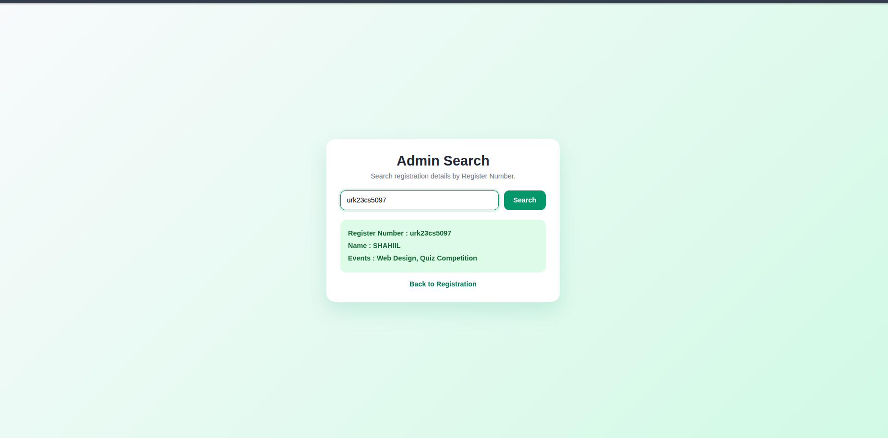
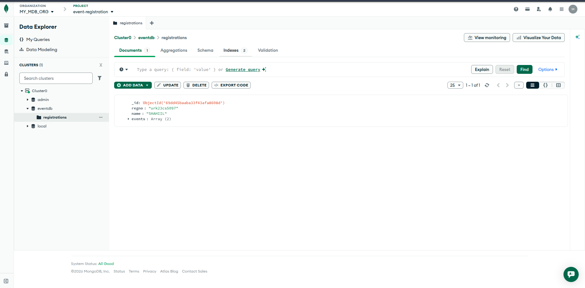

# AIWED-EX-9 — Event Registration System

A Node.js + Express + MongoDB web application for event registration and admin search.

## Features

- Student registration with Register Number, Name, and event selection
- Maximum 3 events per registration
- Duplicate Register Number prevention
- Admin search by Register Number
- MongoDB persistence (Local or Atlas)

## Tech Stack

- Node.js
- Express
- MongoDB (`mongodb` driver)
- HTML/CSS/JavaScript

## Project Structure

```text
event-registration/
├── assets/
│   ├── output-1.png
│   └── output-2.png
├── public/
│   ├── admin.html
│   └── index.html
├── package.json
├── package-lock.json
├── server.js
└── README.md
```

## Setup and Run

1. Install dependencies:
   ```bash
   npm install
   ```
2. Set MongoDB connection:
   ```bash
   export MONGO_URL='your_mongodb_connection_string'
   export DB_NAME='eventdb'
   ```
3. Start server:
   ```bash
   npm start
   ```
4. Open:
   - Registration page: `http://localhost:3000`
   - Admin page: `http://localhost:3000/admin`

## API Endpoints

- `POST /register` — create registration
- `GET /search?regno=<register_number>` — fetch registration by regno

## Output Screenshots

### Registration Page



### Admin Search Page



